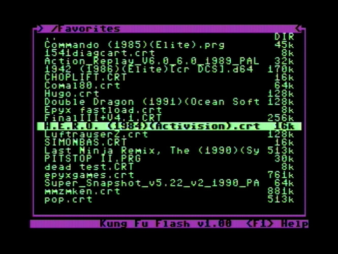
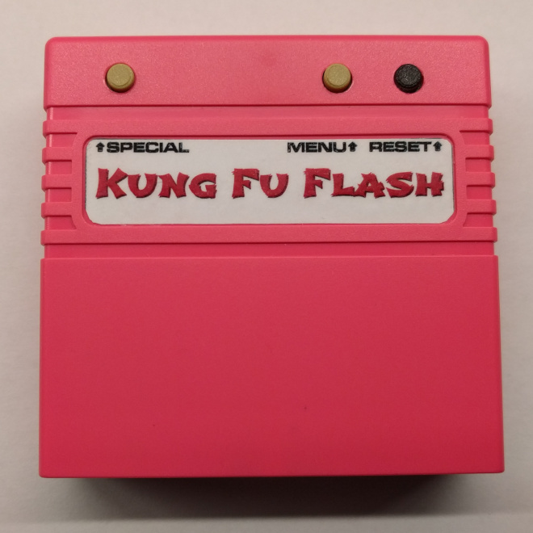
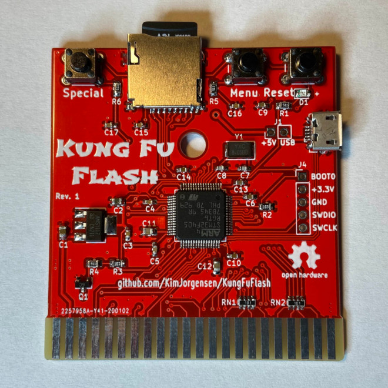

# Kung Fu Flash
Cartridge for the Commodore 64 that packs a punch.

Kung Fu Flash can emulate different cartridge types and load PRG files and single-load files from D64 images.
Just place your desired CRT, PRG or D64 files on a FAT formatted microSD card and use the built-in launcher to execute them.

## Supported Cartridges
The following cartridge types are currently supported:

* Normal cartridge (8k, 16k, Ultimax)
* Action Replay v4.x/v5/v6
* Final Cartridge III(+)
* Simons' BASIC
* Fun Play, Power Play
* Ocean type 1
* Epyx Fastload
* C64 Game System, System 3
* Dinamic
* Magic Desk, Domark, HES Australia
* Super Snapshot v5
* Comal-80
* EasyFlash

## Hardware
There are three buttons on the cartridge; a reset button, a menu button for starting the launcher, and a special button that is used by the freezer cartridges.

The PCB will fit the Stumpy Cartridge Case from TFW8b, you just need to drill some holes for the buttons and make a cut for the microSD card.
If you plan to use USB you will need to cut a hole for that as well.

The USB port is active while the launcher is running allowing programs to be transferred from a PC using the EasyFlash 3 USB protocol.
Kung Fu Flash shows up as a standard serial port when connected to a PC not requiring any custom drivers to be installed.
This means, however, that the program on the PC side must be modified to support Kung Fu Flash.
For that reason a modified version of [EasyFlash 3 USB Utilities](3rd_party/ef3utils) has been included in this repository.

## Firmware Update
Just place the KungFuFlash_v1.xx.upd file on the SD card and select the file in the launcher to initiate the firmware update.

For initial firmware installation, [see here](firmware/README.md).

## Limitations
Kung Fu Flash is a so called Software Defined Cartridge where a fast microcontroller emulates cartridge hardware in software.
This makes it extremely flexible, allowing different cartridge types to be supported at a relative low cost.

However, it can be challenging to get the C64 bus timing correct in software and in some places the timing is very close to the limit.
Even though Kung Fu Flash has been tested on different models of the Commodore 64, there is a chance that it doesn't work correctly on your specific model.
Use it at your own risk!

Kung Fu Flash will only work with the PAL version of the Commodore 64 or Commodore 128. The NTSC version is currently not supported.

## Thanks
Kung Fu Flash was based on or uses other open source projects:

* [EasyFlash 3](https://bitbucket.org/skoe/easyflash) by Thomas Giesel
* [Draco Browser](https://csdb.dk/release/?id=89910) by Sascha Bader
* [fatfs-stm32](https://github.com/colosimo/fatfs-stm32) by Aurelio Colosimo
* [FatFs](http://elm-chan.org/fsw/ff/00index_e.html) by ChaN
* [libusb_stm32](https://github.com/dmitrystu/libusb_stm32) by Dmitry Filimonchuk
* [stm32f4-bare-metal](https://github.com/fcayci/stm32f4-bare-metal) by Furkan Cayci
* [OpenC64Cart](https://github.com/SukkoPera/OpenC64Cart) by Giorgioggì
* [EasyFlash 3 USB Utilities](https://csdb.dk/release/?id=150097) by Tomaz Kac

and a few others. Please check the individual files for their license.

Thanks to Bjørn N. Jørgensen for giving this project its name.

Special thanks to the author of [RasPIC64](https://github.com/frntc/RasPIC64) Carsten Dachsbacher for his support and inspiration.
